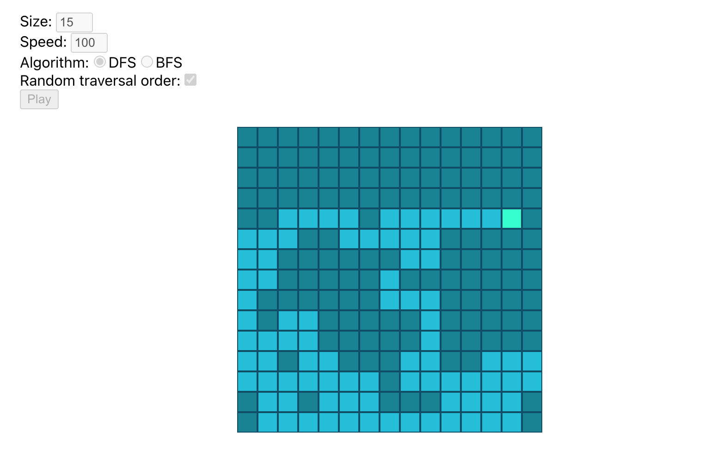

# Visualize DFS vs BFS for a grid of pixels

This is a web app I built for fun, using JavaScript and React, which animates depth-first search and breadth-first search algorithms as they act on a "graph" of pixels.

## Screenshot

## Features

- Resize the grid to custom sizes
- Set a custom animation speed (in milliseconds per visit/pixel update)
- Select DFS or BFS algorithm to use to paint the pixels
- Enable or disable random neighbor selection (vs. a fixed order of neighbor directions)
- Highlights the current pixel that is being visited for easier visualization

## Setup

1. Install Node.js: https://nodejs.org/en
1. Use Git to clone this repo
1. `npm install`
1. `npm start`

The last step will open a new browser tab pointed at `localhost:3000` with the app running
